# Dungeon

> **⚠️ Early-stage prototype:** expect rapid iteration, missing features, and breaking changes. We're sharing the core architecture early so contributors can help shape the design.

Dungeon is a **verifiable roguelike RPG** — a deterministic world where every turn can be proven valid, yet not all truths are visible.

Built on zero-knowledge proofs (ZKPs), Dungeon ensures that every action, roll, and AI move followed the rules **without revealing** hidden information.
The result is a game that's both **honest and mysterious** — fair because it's provable, alive because it's systemic.

At its core, Dungeon explores how **games can become transparent systems of truth** rather than opaque entertainment products.
Each world is procedural, deterministic, and shaped by interacting systems rather than scripts.
Your choices — lighting a torch, sparing an enemy, sealing a door — ripple through the rule system to form emergent stories that feel inevitable, not authored.

> *Fairness without authority. Secrecy without deceit.*

Learn more about the design vision and philosophy in [**philosophy.md**](./docs/philosophy.md)

## Repository Layout

```
crates/
├── client/
│   ├── bootstrap/          # Runtime initialization and configuration
│   ├── frontend/
│   │   ├── core/          # Frontend abstraction: events, messages, view models
│   │   └── cli/           # Terminal UI with examine mode and targeting system
│   └── blockchain/
│       └── sui/           # Sui blockchain client implementation
├── game/
│   ├── core/              # Pure deterministic state machine (actions, engine, validation)
│   └── content/           # Static content and fixtures (maps, items, NPCs, loot tables)
├── runtime/               # Orchestration layer: workers, AI, persistence, oracles
├── zk/                    # Multi-backend ZK proving system (RISC0, SP1, stub)
└── xtask/                 # Development tools (cargo xtask pattern)

contracts/move/            # Sui Move smart contracts (game sessions, proof verification)
docs/                      # Architecture, research notes, design decisions
```

## Prerequisites

- **Rust toolchain** (1.85+ recommended): Install via [rustup](https://rustup.rs/)
- **Just command runner** (recommended): `cargo install just`
- **Sui CLI** (for blockchain deployment): Install via [suiup](https://docs.sui.io/guides/developer/getting-started/sui-install)
- **SP1 toolchain** (for SP1 backend): Install via [sp1up](https://docs.succinct.xyz/getting-started/install.html)

Some crates use async runtimes (`tokio`) and expect a POSIX-like environment. All commands below assume you are in the repository root.

## Quick Start

### Local Gameplay (No Blockchain)

**Recommended:** Use `just` for easier multi-backend development:

```bash
# Install just (one-time setup)
cargo install just

# Fast development with stub backend (no real proofs)
just build stub cli
just run stub cli

# Fast mode (no proof generation, no persistence)
just run-fast stub cli

# Production build with SP1 Groth16 proofs
just build-release sp1 cli
just run-release sp1 cli

# Set default backend via environment
export ZK_BACKEND=stub
just build cli   # uses stub automatically
just run cli

# See all available commands
just --list
just help
```

### With Sui Blockchain Integration

```bash
# Build with Sui blockchain support
just build-release sp1 cli sui

# Run with Sui testnet (requires .env configuration)
just run-release sp1 cli sui
```

See [**DEPLOYMENT.md**](./DEPLOYMENT.md) for comprehensive blockchain deployment instructions.

## Available ZK Backends

Dungeon supports multiple ZK proof backends through feature flags:

| Backend | Status | Proof Type | Size | Speed | Use Case |
|---------|--------|------------|------|-------|----------|
| **stub** | ✅ Implemented | None (instant) | N/A | Instant | Development, testing |
| **risc0** | ✅ Implemented | Groth16 SNARK | ~200 bytes | Slow | Production (Linux x86_64 only) |
| **sp1** | ✅ Implemented | Groth16/PLONK SNARK | ~260 bytes | Medium | Production (all platforms) |
| **arkworks** | 📅 Planned | Custom circuits | TBD | TBD | Future optimization |

**Recommended for development:** `stub` (instant, no setup)
**Recommended for production:** `sp1` (cross-platform, mature tooling)

### Backend Configuration

Set the default backend via environment variable:

```bash
export ZK_BACKEND=stub   # or risc0, sp1, arkworks
just build              # automatically uses $ZK_BACKEND
just run
```

Or specify explicitly:

```bash
just build-release sp1 cli      # Build with SP1 backend and CLI frontend
just run risc0 cli sui  # Run with RISC0 backend, CLI, and Sui integration
```

### Feature Flags

Features can be combined flexibly:

```bash
# Backend features (mutually exclusive)
stub      # Stub prover (testing only)
risc0     # RISC0 zkVM backend
sp1       # SP1 zkVM backend
arkworks  # Arkworks circuits (planned)

# Frontend features (can combine)
cli       # Terminal UI frontend

# Blockchain features (can combine)
sui       # Sui blockchain integration

# Examples
just build stub cli              # Local play, no proofs
just build-release sp1 cli               # Local play with SP1 proofs
just build-release sp1 cli sui           # Full stack: SP1 + CLI + Sui
just run-fast stub cli           # Fast mode: no proofs, no persistence
```

## Common Just Commands

### Building and Running

| Command | Description |
|---------|-------------|
| `just build <features>` | Build workspace with specified features |
| `just run <features>` | Run CLI client with specified features |
| `just run-fast <features>` | Run in fast mode (no proofs, no persistence) |
| `just run-release <features>` | Run optimized release build |
| `just build-release <features>` | Build optimized release binary |

### Development Workflow

| Command | Description |
|---------|-------------|
| `just dev` | Fast dev loop: format + lint + test (stub backend) |
| `just fmt` | Format all code with rustfmt |
| `just lint <features>` | Run clippy lints with specified features |
| `just test <features>` | Run all tests with specified features |
| `just check <features>` | Run format + lint + tests together |
| `just pre-commit` | Pre-commit checks (recommended before committing) |

### Testing and Validation

| Command | Description |
|---------|-------------|
| `just test <features>` | Run all tests |
| `just test-lib <features>` | Run library tests only |
| `just test-integration <features>` | Run integration tests only |
| `just check-all` | Verify all backends compile (CI use) |
| `just ci` | Full CI simulation |

### Data and Logs

| Command | Description |
|---------|-------------|
| `just tail-logs [session]` | Monitor client logs in real-time |
| `just sessions` | List all available game sessions |
| `just read-state <nonce>` | Inspect saved game state at nonce |
| `just read-actions [nonce]` | Inspect action log for session |
| `just clean-data` | Clean save data and logs (with confirmation) |
| `just clean-logs` | Clean only logs (faster) |

### Documentation and Info

| Command | Description |
|---------|-------------|
| `just help` | Show detailed help with examples |
| `just info` | Show current backend configuration |
| `just doc <backend>` | Generate and open documentation |
| `just --list` | List all available commands |

## Environment Variables

### General Configuration

```bash
# ZK Backend selection
ZK_BACKEND=stub              # Default backend for just commands (stub, risc0, sp1)

# Runtime behavior
ENABLE_ZK_PROVING=false      # Disable proof generation (fast mode)
ENABLE_PERSISTENCE=false     # Disable state/action persistence (fast mode)
RUST_LOG=info               # Logging level (info, warn, debug)
```

### RISC0 Specific

```bash
RISC0_SKIP_BUILD=1          # Skip guest builds during cargo build
RISC0_DEV_MODE=1            # Fast dev proofs (when using risc0 backend)
```

### SP1 Specific

```bash
SP1_PROVER=network          # SP1 prover mode (cpu, network, cuda, mock)
SP1_PROOF_MODE=groth16      # SP1 proof type (compressed, groth16, plonk)
NETWORK_PRIVATE_KEY=<key>   # Private key for SP1 Prover Network
```

### Sui Blockchain

```bash
SUI_NETWORK=testnet         # Sui network (local, testnet, mainnet)
SUI_PACKAGE_ID=0x...        # Deployed game contract package ID
SUI_VK_OBJECT_ID=0x...      # Verifying key object ID
SUI_RPC_URL=<url>           # Custom RPC endpoint (optional)
SUI_GAS_BUDGET=100000000    # Gas budget in MIST (default: 0.1 SUI)
```

See [`.env.example`](.env.example) for a complete configuration template.

## Sui Blockchain Integration

Dungeon integrates with Sui blockchain for:

- **On-chain game sessions**: Create and manage game sessions as Sui objects
- **Proof verification**: Submit ZK proofs for validation (currently disabled - see Known Issues)
- **Action log storage**: Store action sequences in Walrus decentralized storage
- **Challenge period**: Time-delayed finalization for dispute resolution

### Deployment Workflow

1. **Deploy Move contracts to Sui testnet**:
   ```bash
   sui client switch --env testnet
   sui client faucet
   sui client publish --path contracts/move --gas-budget 500000000 --with-unpublished-dependencies
   ```

2. **Configure environment**:
   ```bash
   # Copy deployment info to .env
   SUI_NETWORK=testnet
   SUI_PACKAGE_ID=<package-id-from-deployment>
   ```

3. **Run client with Sui integration**:
   ```bash
   just run sp1 cli sui
   ```

See [**DEPLOYMENT.md**](./DEPLOYMENT.md) for comprehensive deployment instructions including:
- Network setup (local, testnet, mainnet)
- Address management and funding
- Contract deployment and upgrades
- Troubleshooting common issues

### Walrus Decentralized Storage

Action logs are stored in [Walrus](https://walrus.xyz/), a decentralized blob storage protocol built on Sui:

- **Cryptographic integrity**: Blob IDs serve as content-addressed action roots
- **Availability guarantees**: Redundant storage across multiple storage nodes
- **Challenge period**: Action logs retained on-chain for dispute resolution
- **Gas efficiency**: Large action sequences stored off-chain, only commitments on-chain

## Known Issues

### ZK Proof Verification (Temporary)

**Status**: ZK proof generation works perfectly, but on-chain verification is temporarily disabled.

**Reason**: SP1 5.2 Groth16 verifying key format is incompatible with Sui's `groth16` Move module. This is a known serialization format issue between SP1 SDK versions.

**What Works**:
- ✅ Proof generation (SP1 Groth16 proofs are generated successfully)
- ✅ All proof data is correctly structured (journal, public inputs, proof points)
- ✅ Blockchain transaction submission
- ✅ Action log storage in Walrus

**What's Disabled**:
- ❌ On-chain ZK proof verification (commented out in `game_session.move`)

**Post-Hackathon Plan**:
- Investigate exact VK format requirements for Sui's groth16 module
- Either downgrade SP1 to 5.0.0 or await sp1-sui compatibility update
- Re-enable verification once VK compatibility is resolved

See [`contracts/move/sources/game_session.move:227-251`](contracts/move/sources/game_session.move#L227-L251) for detailed technical comments.

## Architecture

```mermaid
flowchart TB
    %% --- Node Styling Definitions ---
    classDef frontend fill:#bbdefb,stroke:#1976d2,stroke-width:2px,color:#0d47a1;
    classDef client fill:#c5cae9,stroke:#303f9f,stroke-width:2px,color:#1a237e;
    classDef runtime fill:#b2dfdb,stroke:#00796b,stroke-width:2px,color:#004d40;
    classDef core fill:#ffccbc,stroke:#d84315,stroke-width:2px,color:#bf360c;
    classDef zk fill:#e1bee7,stroke:#7b1fa2,stroke-width:2px,color:#4a148c;
    classDef chain fill:#cfd8dc,stroke:#455a64,stroke-width:2px,color:#263238;
    classDef walrus fill:#ffe0b2,stroke:#f57c00,stroke-width:2px,color:#e65100;

    %% --- Subgraphs & Nodes ---
    subgraph Frontends ["🖥️ Presentation Layer"]
        direction TB
        cli_client["📟 Terminal UI<br/>(client/frontend/cli)"]:::frontend
        future_ui["🌐 Future Frontends<br/>(Bevy, WebAssembly)"]:::frontend
    end

    subgraph Client ["🔌 Client Layer"]
        direction TB
        orchestrator["🎬 Client Orchestrator"]:::client
        blockchain_client["🔗 Blockchain Client<br/>(Sui Adapter)"]:::client
    end

    subgraph Runtime ["⚙️ Runtime Layer"]
        direction TB
        api_mod["📡 api/<br/>RuntimeHandle · GameEvent"]:::runtime
        runtime_orch["🧠 Runtime Orchestrator"]:::runtime
        workers_mod["👷 workers/<br/>Simulation · Prover · Persistence"]:::runtime
        oracle_mod["🔮 oracle/<br/>MapOracle · ItemOracle"]:::runtime
        repo_mod["💾 repository/<br/>ActionBatch · StateRepo"]:::runtime
    end

    subgraph Game ["🦀 Game Logic (Shared)"]
        direction TB
        game_core["🧩 game-core<br/>(Engine, State, Actions)"]:::core
        game_content["📦 game-content<br/>(Static Assets)"]:::core
    end

    subgraph ZK ["🔐 Zero-Knowledge"]
        direction TB
        prover_backend["🛡️ Proving Backends<br/>(RISC0, SP1, Stub)"]:::zk
    end

    subgraph Infrastructure ["☁️ On-Chain & Storage"]
        direction TB
        move_contract["💧 Game Session<br/>(Sui Move)"]:::chain
        walrus["🦭 Walrus Storage<br/>(Action Logs)"]:::walrus
    end

    %% --- Connections ---
    cli_client -->|"implements"| orchestrator
    
    orchestrator -->|"initializes"| runtime_orch
    orchestrator -->|"uses"| blockchain_client
    
    blockchain_client -.->|"submits proofs"| move_contract
    blockchain_client -.->|"uploads logs"| walrus

    runtime_orch -->|"exposes"| api_mod
    runtime_orch -->|"manages"| workers_mod
    
    workers_mod -->|"executes"| game_core
    workers_mod -->|"generates proofs"| prover_backend
    workers_mod -->|"persists"| repo_mod
    workers_mod -->|"injects Oracle"| game_core
    
    oracle_mod -->|"wraps"| game_content
    oracle_mod -.->|"implements traits"| game_core
    
    prover_backend -->|"proves"| game_core

    %% --- Background Styling (Soft Pastel Colors) ---
    style Frontends fill:#f0f8ff,stroke:#90caf9,stroke-width:1px,stroke-dasharray: 5 5
    style Client fill:#f3f4fa,stroke:#9fa8da,stroke-width:1px,stroke-dasharray: 5 5
    style Runtime fill:#e8f5e9,stroke:#80cbc4,stroke-width:1px,stroke-dasharray: 5 5
    style Game fill:#fffbe6,stroke:#ffab91,stroke-width:1px,stroke-dasharray: 5 5
    style ZK fill:#f3e5f5,stroke:#ce93d8,stroke-width:1px,stroke-dasharray: 5 5
    style Infrastructure fill:#f5f5f5,stroke:#b0bec5,stroke-width:1px,stroke-dasharray: 5 5
```



### Three-Layer Design

1. **game-core**: Pure deterministic state machine
   - 3-phase action pipeline (pre_validate → apply → post_validate)
   - 5-layer stat system with unified bonus calculations
   - Oracle pattern for static content
   - Zero dependencies on I/O, randomness, or crypto

2. **runtime**: Orchestration and side effects
   - Worker system (SimulationWorker, ProverWorker, PersistenceWorker)
   - Topic-based event bus for reactive updates
   - Utility-based AI (Intent → Tactic → Action)
   - Repository layer for state/checkpoint/log persistence

3. **client**: Multi-frontend architecture
   - Terminal UI with examine mode and tactical targeting
   - Sui blockchain client for proof submission
   - Shared UX primitives across frontends

See [`docs/architecture.md`](docs/architecture.md) for detailed design documentation.

## Development Tools (xtask)

The `xtask` crate provides development utilities following the [cargo xtask pattern](https://github.com/matklad/cargo-xtask):

```bash
# List available tasks
cargo xtask --help

# Tail logs for a session
cargo xtask tail-logs --session <session-id>

# Clean save data and logs
cargo xtask clean-data --all

# Extract SP1 VK from proof (for debugging)
cargo xtask extract-vk --proof proof.bin --output vk.bin

# Inspect proof structure
cargo xtask inspect-proof --proof proof.bin

# Sui deployment helpers
cargo xtask sui keygen --alias my-key
cargo xtask sui setup --network testnet
```

## Contributing

We welcome contributions!

**Before submitting a PR**:
1. Run `just pre-commit` to ensure all checks pass
2. Read the full [Contributing Guidelines](.github/CONTRIBUTING.md)
3. Check [`TODOs.md`](TODOs.md) for prioritized tasks

**Development workflow**:
```bash
just dev        # Format, lint, test (fast iteration)
just check-all  # Verify all backends compile
just pre-commit # Final checks before committing
```

## Additional Resources

- [**CLAUDE.md**](CLAUDE.md) – Comprehensive project guide for AI-assisted development
- [**DEPLOYMENT.md**](DEPLOYMENT.md) – Sui blockchain deployment instructions
- [**docs/architecture.md**](docs/architecture.md) – High-level system design and diagrams
- [**docs/philosophy.md**](docs/philosophy.md) – Design vision and motivations
- [**.github/CONTRIBUTING.md**](.github/CONTRIBUTING.md) – Contributing guidelines and code standards
