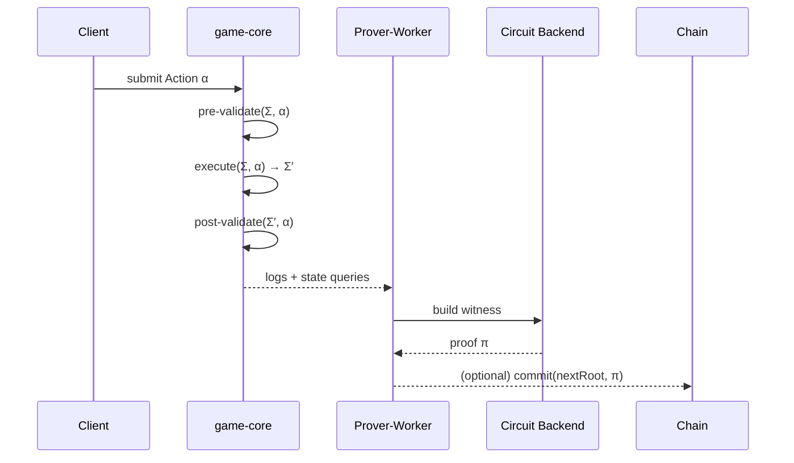

# Verifiable Action‑Validity System

> **Status:** Working draft
>
> **Scope:** Architecture and validation model for the Dungeon action-validity system.

---

## 0. Executive Summary

* **Goal:** Prevent cheating and enable audits by proving that each *action* was legal for the prior state, rather than proving the whole game runtime.
* **Approach:** Model gameplay as a **finite state machine (FSM)** with strict `pre‑validate → execute → post‑validate` phases. Encode only the *validation* logic into ZK circuits; keep heavy simulation (AI, physics, rendering) off‑circuit.
* **Blockchain Footprint:** Persist only **proof artifacts** and periodic **state commitments** on‑chain. All other computation stays off‑chain for responsiveness.
* **Outcomes:** Low-latency gameplay, succinct proofs, and credible fairness without forcing a zkVM to re‑execute the entire engine.

## 1. Philosophy & Design Tenets

### 1.1 Determinism First

Dungeon’s runtime is a pure function of `(prior_state, action, entropy) → next_state`, where entropy is injected via deterministic providers (e.g., seeded PRNG/VRF transcripts). No hidden side‑effects. This ensures debuggability, reproducible tests, and consistent witnesses.

### 1.2 Prove Validity, Not Everything

We do **not** attempt to simulate AI/physics in-circuit. We prove that *given a prior state commitment*, an action is *admissible* per rules. This keeps circuits small and stable while allowing rich off‑circuit systems.

### 1.3 Minimal On‑Chain Data

On‑chain smart contracts only store: (a) **state commitments** (Merkle/Poseidon roots) at declared checkpoints, and (b) **proofs** that actions from commitment *S* to *S’* were valid (optionally recursively aggregated).

### 1.4 Moddability via Interfaces

Rulesets, entities, and effects are versioned. A ruleset’s **Validation ABI** is stable and circuit‑derivable, allowing content mods without re‑architecting the proof layer.

## 2. System Model

### 2.1 Core FSM

```text
State Σ: persistent world snapshot (entities, tiles, inventories, clocks…)
Action α: typed description of intent (actor_id, opcode, params, nonce)
Transition τ: Σ × α → Σ′

Phases: pre‑validate(Σ, α) → execute(Σ, α) → post‑validate(Σ′, α)
```

* **pre‑validate:** check static preconditions (permissions, range, resources, cooldowns, collision, etc.).
* **execute:** apply effects (damage, movement, spawns) in the off‑circuit engine.
* **post‑validate:** enforce conservation and invariants (no negative HP beyond rules, inventories non‑negative, map bounds, sum‑checks, etc.).

### 2.2 Commitments & Identifiers

* **State commitment** `C(Σ)`: Poseidon‑Merkle root over a canonical serialization of Σ.
* **Action nonce**: `n = H(actor||seq)`; prevents replays and enables ordering proofs.
* **Action commitment** `A(α)`: commitment to opcode & params for witness binding.

### 2.3 Trust & Threats

* Clients are untrusted; servers/workers generate witnesses/proofs.
* Off‑chain actors may attempt **replay**, **forging**, **withholding**, **desync**, or **DoS**.
* Chain verifies *correctness* (validity) but not *liveness*; sessions may adopt quorum/committee policies for availability.

## 3. Architecture Overview

```mermaid
flowchart LR
  subgraph Client
    UI[UI] --> CL[Client Runtime]
  end
  subgraph Core
    GC[game-core (deterministic)]
    VP[validate phases]
  end
  subgraph Proving
    PW[prover-worker]
    ZK[ZK circuits]
    RA[recursive aggregator]
  end
  subgraph Chain
    SC[(StateCommitments)]
    VC[[Verifier Contract]]
  end

  CL -->|actions α| GC
  GC -->|checkpoints + logs| PW
  PW -->|witness| ZK -->|proof π| RA -->|π*| VC
  GC -->|C(Σ), C(Σ′) at checkpoints| SC
  VC -->|accept/reject| SC
```

**Key idea:** `validate` circuits are fed by **deterministic execution logs** from `game-core`. The circuit proves: “Given `C(Σ)` and `α`, there exists a witness consistent with the logs such that rules’ pre/post conditions hold; thus `Σ → Σ′` is legal.”

## 4. Validation Circuits

### 4.1 Interface

```rust
pub struct ValidateInput {
    pub prior_state_root: Field,
    pub action_commitment: Field,
    pub actor_id: Field,
    pub nonce: Field,
    pub rule_version: u32,
}

pub struct ValidateOutput {
    pub next_state_root: Field,
    pub action_nullifier: Field, // binds (actor, nonce, action)
}
```

* **Soundness:** A valid proof ensures that `next_state_root` is reachable by one legal application of `α` to any `Σ` consistent with `prior_state_root`.
* **Completeness:** Any legal action has a corresponding witness derived from `game-core` instrumentation.

### 4.2 Witness Production

* `game-core` emits a **deterministic log** for each phase (range checks, balance checks, path queries results, etc.), with **query commitments** for any indexed data (e.g., Merkle proofs of entity slots). The prover worker converts these to circuit witnesses.
* Queries against state (e.g., *tile at (x,y)*) are proven with sparse Merkle proofs to the root `prior_state_root`.

### 4.3 Composition

* **Recursive aggregation**: bundle `k` action proofs into one `π*` (batch verification on-chain).
* **Segment proofs**: prove a sequence from `C(Σ_i)` → `C(Σ_j)` with per‑action subproofs, enabling fast audits.

## 5. State Model & Data Commitments

### 5.1 Canonical Serialization

* Fixed endianness, length‑prefixing, and domain‑separated hashing.
* Stable schemas (version‑tagged) for entities, inventories, maps.

### 5.2 Merkle Layout

* **Global root** over namespaces: `root = H(world_root || entity_root || inv_root || …)`
* **Sparse Merkle Trees (SMT)** for large sparse spaces (tile map, entity ids).
* **Packed Merkle** subtrees for dense arrays (inventories, status effects) for efficient multi‑openings.

### 5.3 Entropy

* **RNG inputs** are transcripted (e.g., Fiat‑Shamir using prior root + action commitment), or **VRF** beacons per tick/turn. RNG derivations are recomputable and provable.

## 6. Multiplayer, Authority & Sync

### 6.1 Session Models

* **Single‑authority server**: fast iteration; server publishes commitments and proofs; clients verify (optionally lazily).
* **Committee authority**: M‑of‑N prover/attestors sign off on checkpoints; mitigates withholding and equivocation.
* **Peer‑to‑peer** (experimental): CRDT‑style queues with action ordering via nullifiers and dispute‑proof fallbacks.

### 6.2 Ordering & Reorgs

* Actions carry `(actor_id, nonce)`; queues enforce strictly increasing nonces per actor. Conflicts resolved by authority policy. Checkpoints are monotonic; late actions target the latest finalized commitment.

## 7. On‑Chain Integration

### 7.1 Verifier Contract (Ethereum‑style)

```solidity
interface IVerifier {
  function verify(
    bytes calldata proof,
    bytes32 priorRoot,
    bytes32 nextRoot,
    bytes32 actionNullifier,
    uint32 ruleVersion
  ) external view returns (bool);
}
```

* **Checkpoints:**

  * `commit(nextRoot, proof)` → records `nextRoot` if `verify` passes and `priorRoot` matches last recorded root.
  * Optional **segment verify** for aggregated sequences.

### 7.2 Costs & Formats (indicative)

* **Proof systems:** Groth16 (tiny proofs, trusted setup), Plonkish/Halo2 (universal setup), STARKs (no setup, larger proofs). Choose per chain’s gas/verify costs and desired trust model.
* **Compression:** Use calldata‑friendly encodings; consider on‑chain verification vs. succinct on‑chain checks with off‑chain storage and fraud windows.

## 8. Developer Experience (DX)

### 8.1 Validation ABI (Rules to Circuit)

* Each rule registers a **Validation Spec** (inputs, lookups, invariants). Code generators produce Rust traits + circuit stubs from the spec.
* A *single* source of truth drives both `game-core` checks and circuit constraints.

### 8.2 GameIR (Optional, when rules grow)

* A small, MLIR‑like IR to express validation constraints (range, membership, conservation, table lookups). Backends: Halo2/Plonkish, STARK, Groth16.
* IR → circuit lowering enables cross‑backend portability and micro‑optimizations (e.g., shared lookup tables for stat curves).

### 8.3 Testing & Reproducibility

* **Golden tests:** fixed seeds and fixture states; compare roots & action effects across platforms.
* **Proof harness:** `simulate → log → witness → prove → verify` CI job; regression on constraints.
* **Fuzzing:** generate random but admissible actions and assert proofs exist; generate invalid actions and assert proving fails.

## 9. Security Considerations

### 9.1 Soundness Gaps to Watch

* **Witness withholding:** server proves only chosen actions; mitigate via committee or periodic forced checkpoints.
* **Data availability:** off‑chain logs may vanish; mitigate with DA layers or IPFS + content addresses pinned by community.
* **Desync risk:** strict canonical serialization; include ruleVersion and content hashes into commitments.

### 9.2 DoS & Abuse

* Bound per‑action verification costs and circuit sizes.
* Pre‑screen actions before heavy witness building.
* Rate‑limit by actor nullifiers; optional stake/bond for spammy lobbies.

### 9.3 Upgrades

* Version every ruleset and circuit. New versions can only extend—never shrink—validation domains without explicit migration.

## 10. Performance Targets (initial)

* **Action proof time:** < 500ms on commodity desktop for simple moves/attacks (engineering goal; batchable).
* **Aggregates:** 64–256 action proofs per recursive batch.
* **State size:** roots < 64 bytes; typical Merkle proofs < 1–2 KB per accessed slot.
* **Client latency:** < 100ms perceived input→feedback (proofs may complete asynchronously; verification can lag but stays auditable).

## 11. Roadmap

1. **MVP**

   * Deterministic `game-core` with phase logs.
   * Poseidon‑Merkle state; entity + tile namespaces.
   * Halo2/Plonkish prototype circuits for Move, Attack, Pickup.
   * Single‑authority server; on‑chain verifier mock.

2. **Beta**

   * Recursive aggregation; ruleVersioning; proof harness in CI.
   * Validation Spec → codegen pipeline; early GameIR.
   * Committee authority; checkpoint publisher and DA pins.

3. **v1**

   * Stable Validation ABI; modding SDK.
   * Multi‑backend circuits (Groth16 + Plonkish); chain adapters (L1/L2).
   * Audit tooling (segment verifiers, timeline browser).

## 12. Glossary

* **Action validity:** Proof that an action *could* legally transition a prior committed state to a next state.
* **Checkpoint:** A committed state root along a timeline of play.
* **Nullifier:** Unique identifier binding actor+nonce+action to prevent replays and enable ordering.
* **Validation Spec:** Declarative rule description from which both engine checks and circuit constraints are derived.

## 13. Appendix A — Example Validation Spec

```toml
# move.rule
[name]
opcode = "MOVE"
version = 1

[inputs]
actor_id = "Field"
dx = "i8"; dy = "i8"

[lookups]
# SMT proofs against prior_state_root
actor_tile = { path = "entities/{actor_id}/pos", proof = "smt" }
target_tile = { path = "tiles/{x}/{y}", proof = "smt" }

[constraints]
- "|dx| + |dy| == 1"
- "target_tile.walkable == 1"
- "distance(actor_tile, target_tile) == 1"
- "cooldown(actor_id, MOVE) == 0"

[effects]
- "entities/{actor_id}/pos := target_tile"
- "cooldown(actor_id, MOVE) := base_cd"
```

## 14. Appendix B — Prover Pipeline



## 15. References & Prior Art (non‑exhaustive)

* Validity‑only proving vs zkVM full re‑execution in interactive apps.
* Merkleized state + SMT non‑membership proofs.
* Recursive proof systems and batch verification strategies.
* Deterministic simulation and reproducible build/test pipelines.
