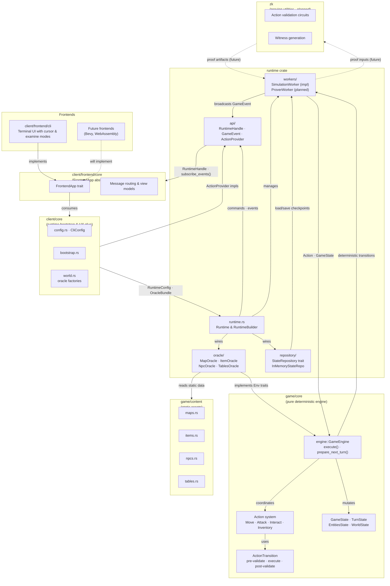
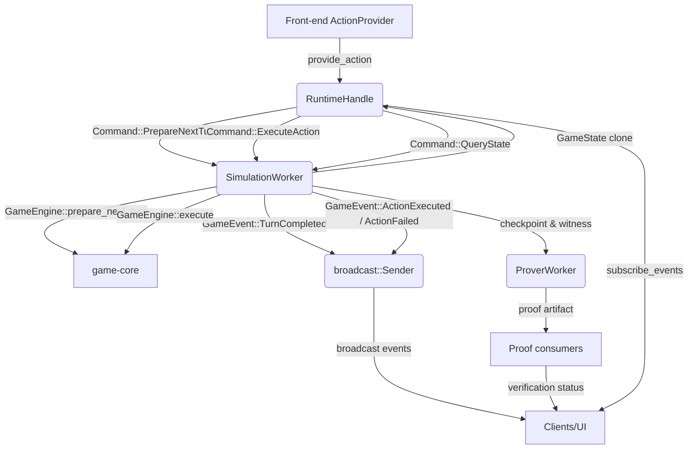

# Dungeon Project Architecture

> _Last updated: 2025-10-13_

## 1. System Overview

The Dungeon project is structured as a Rust workspace composed of multiple crates that collaborate to deliver a deterministic, provable dungeon crawler. The high-level flow is:

1. **Front-ends (CLI, UI, automation)** gather player and NPC input through the `FrontendApp` abstraction.
2. **`client-core`** translates front-end messages into runtime-facing actions and bootstraps oracle bundles.
3. **`runtime`** orchestrates the game loop via the `SimulationWorker`, delegates gameplay execution to background workers, and emits game events through a broadcast channel.
4. **`game-core`** provides the pure deterministic simulation engine with a comprehensive action system (`GameEngine::execute`), domain models (`GameState`, `Action`), and validation schema (pre-validate, execute, post-validate phases).
5. **`game-content`** supplies static content (maps, items, NPCs, loot tables) consumed by oracle implementations.
6. **`zk`** (planned) will contain proving-friendly utilities shared by the prover worker and any off-chain verification services.
7. **Persistence and blockchain integration (future)** will bridge runtime checkpoints to chain-facing artifacts.

The guiding principles are:

- **Layered boundaries**, so each crate only depends on the surfaces it requires.
- **Determinism first**, ensuring all runtime decisions are reproducible for ZK/STARK proving.
- **Pluggable providers**, letting clients swap input sources, oracle data, and persistence backends.
- **Observability**, exposing event streams and handles suitable for synchronous or async clients.

## 2. Workspace Layout

```
root
├── crates
│   ├── client
│   │   ├── core/              # Shared UX glue (config, messages, view models, oracle factories)
│   │   └── frontend/
│   │       ├── core/          # Frontend abstraction layer (FrontendApp trait, message routing)
│   │       └── cli/           # Terminal UI with cursor system and examine mode
│   ├── game
│   │   ├── core/              # Pure deterministic state machine (no I/O, crypto, or randomness)
│   │   └── content/           # Static content and fixtures (maps, items, NPCs, loot tables)
│   ├── runtime/               # Orchestrator, API façade, workers, oracle/repository adapters
│   └── zk/                    # Proving-focused utilities and shared gadgets (planned)
├── docs/                      # Architecture, research notes, design decisions
└── target/                    # Build artifacts (ignored)
```

### 2.1 Workspace Dependency Graph



Arrows are annotated with the primary data exchanged between crates or modules, illustrating both build-time dependencies and runtime flow.

## 3. Runtime Architecture

The `runtime` crate is the central orchestrator. Its module structure mirrors the runtime layers:

- **`api/`**: Public surface consumed by other crates
  - `RuntimeHandle`: Client-facing API for action execution and state queries
  - `GameEvent`: Broadcast events (TurnCompleted, ActionExecuted, ActionFailed, etc.)
  - `ActionProvider`: Async trait for pluggable input sources
  - Error types: `RuntimeError`, result types
- **`runtime.rs`**: Builder-based orchestrator that wires channels, workers, and providers
  - `RuntimeBuilder`: Fluent API for configuring the runtime
  - `Runtime`: Owns workers, manages lifecycle, exposes `RuntimeHandle`
- **`workers/`**: Background tasks coordinating game execution
  - `SimulationWorker`: Owns canonical `GameState`, processes turns and actions, broadcasts events
  - `ProverWorker`: Placeholder for ZK proof generation (planned)
- **`oracle/`**: Adapters exposing static game content compatible with `game-core` environment traits
  - `MapOracleImpl`, `ItemOracleImpl`, `NpcOracleImpl`, `TablesOracleImpl`, `ConfigOracleImpl`
  - `OracleManager`: Bundles all oracles for injection into `GameEngine`
- **`repository/`**: Traits and implementations for persisting mutable state
  - `StateRepository`: Trait for load/save/checkpoint operations
  - `InMemoryStateRepo`: Testing implementation

### 3.1 Runtime Control Flow



1. Clients ask the `RuntimeHandle` to prepare the next turn, which routes a command to the `SimulationWorker`.
2. The worker invokes `game-core::GameEngine`, updates the authoritative `GameState`, and emits events.
3. After deciding the next action via the appropriate `ActionProvider`, the client issues `ExecuteAction`.
4. Successful execution updates the active set, emits action events, and hands a checkpoint plus witness data to the prover worker, which produces proof artifacts for downstream consumers and UIs.
5. Front-ends consume both gameplay events and proof status; failures continue to surface as `ActionFailed` events for immediate feedback.

### 3.2 Worker Responsibilities

- **Simulation Worker** ✅ **Implemented**
  - Owns the canonical `GameState` and runs the game loop
  - Processes commands from `RuntimeHandle`:
    - `PrepareNextTurn`: Calls `GameEngine::prepare_next_turn()` to advance turn counter and activate entities
    - `ExecuteAction`: Validates and executes player/NPC actions via `GameEngine::execute()`
    - `QueryState`: Returns cloned `GameState` for inspection
  - Broadcasts `GameEvent` notifications:
    - `TurnCompleted(Tick)`: New turn prepared
    - `ActionExecuted(EntityId, Action, StateDelta)`: Action succeeded with state changes
    - `ActionFailed(EntityId, Action, Error)`: Action validation/execution failed
  - Manages entity activation tracking and turn-based cooldowns
  - Thread-safe: Runs in background tokio task, communicates via MPSC channels

- **Prover Worker** 📋 **Planned**
  - Will consume checkpoints/state deltas from simulation worker
  - Generate zero-knowledge proofs of action validity:
    - Prove that action transitions satisfied pre-validate, execute, post-validate phases
    - Use circuits from `zk` crate for validation logic
  - Emit proof artifacts via broadcast channel for client consumption
  - Run in parallel with simulation worker without blocking gameplay
  - Integration points already present in architecture

- **Submitter / Chain Worker** 📋 **Planned**
  - Package proofs and state commitments for blockchain submission
  - Handle transaction lifecycle: signing, submission, confirmation
  - Implement retry logic, rate limiting, gas management
  - Monitor on-chain verification results

## 4. Action Providers

**Action Providers** are the pluggable input layer allowing diverse sources of game actions.

The `ActionProvider` async trait enables:

```rust
pub trait ActionProvider: Send + Sync {
    async fn provide_action(
        &self,
        state: &GameState,
        entity_id: EntityId,
    ) -> Result<Action>;
}
```

**Current Implementations:**

- **`WaitActionProvider`** ✅: Default provider that always returns `Action::Wait`, used for testing and idle entities
- **CLI Human Input** ✅: Implemented in `client-frontend-cli`, collects player commands via terminal interface
  - Validates entity ownership and turn alignment
  - Supports movement (WASD), attack (Space), inventory, examine mode
  - Cursor-based targeting for combat and interactions

**Planned Implementations:**

- **AI / NPC Scripts** 📋: Heuristic-based or ML-powered decision making for NPCs
- **Replay Provider** 📋: Deterministic playback from recorded action sequences for regression tests
- **Remote Providers** 📋: gRPC/WebSocket-based providers for multiplayer or cloud-based agents
- **On-chain Agents** 📋: Blockchain-based decision making (smart contract triggered actions)

## 5. Oracle and Repository Layers

### 5.1 Oracle Bundle

`OracleManager` wraps immutable game content sourced from map, item, table, and NPC oracle implementations. These adapters:

- Serve `game-core` traits with deterministic, read-only data.
- Are typically constructed by `client-core` factories (`TestOracleFactory`, etc.).
- Can be swapped with real content once `game-content` is populated.

Planned enhancements:

- Streaming content updates for live events.
- Content versioning to align with provable game states.

### 5.2 Repositories

The repository layer persists mutable runtime data:

- `StateRepository`: trait describing load/save/checkpoint operations.
- `InMemoryStateRepo`: current implementation for tests and demos.

Upcoming work:

- Database-backed repositories (RocksDB, Postgres) for durable saves.
- Snapshot compression and Merkle commitments for proofs.
- Gossip integration to share state/off-chain updates across nodes.

## 6. Front-end Integration

The client crates implement a layered architecture for diverse UI implementations:

### 6.1 `client-core` (Bootstrap & Configuration)

- **Configuration**: `CliConfig` for runtime parameters (map size, entity counts, etc.)
- **Bootstrap**: Constructs `RuntimeConfig` and `OracleBundle` from configuration
- **Oracle Factories**: `TestOracleFactory` and production factories for content injection
- **Message Types**: Shared types for client-runtime communication

### 6.2 `client/frontend/core` (Frontend Abstraction)

✅ **Implemented** - Provides `FrontendApp` trait for frontend implementations:

```rust
pub trait FrontendApp {
    async fn run(self) -> anyhow::Result<()>;
}
```

Key components:
- **View Models**: Transform `GameState` into presentation-friendly structures
- **Message Routing**: Translates frontend events into runtime commands
- **Event Consumption**: Subscribe to `GameEvent` broadcasts for UI updates

### 6.3 `client/frontend/cli` (Terminal Interface)

✅ **Implemented** - Full-featured async terminal application:

**Architecture:**
- `CliApp`: Main application struct implementing `FrontendApp`
- Event loop: Processes terminal input, runtime events, and renders UI
- State management: Tracks UI mode (Normal, Examine), cursor position, targeting

**Features:**
- **Examine Mode**: Press `E` to enter cursor-based exploration
  - Navigate with WASD to inspect map tiles and entities
  - View detailed entity stats, items, and tile information
- **Cursor System**:
  - Manual cursor movement in examine mode
  - Automatic cursor targeting for combat (nearest enemy selection)
- **Action Input**: WASD movement, Space for attack, inventory management
- **Real-time Updates**: Subscribes to runtime events for immediate feedback

### 6.4 Future Frontends

📋 **Planned** - Additional frontend implementations:

- **Bevy Frontend**: 2D/3D graphical client with same `FrontendApp` trait
- **WebAssembly UI**: Browser-based client for web deployment
- **Headless Client**: For AI training and batch simulation

All future frontends will:
- Implement `FrontendApp` trait from `client/frontend/core`
- Reuse `client-core` bootstrap and configuration
- Subscribe to same `GameEvent` broadcasts
- Use same `ActionProvider` abstractions

## 7. Proving and Blockchain Integration Roadmap

| Component | Status | Description |
|-----------|--------|-------------|
| **Action Validation System** | ✅ Implemented | Three-phase validation (pre-validate, execute, post-validate) in `game-core` |
| **State Delta Tracking** | ✅ Implemented | `StateDelta` captures all state mutations for witness generation |
| **Deterministic Engine** | ✅ Implemented | Pure functional `GameEngine` with no I/O or randomness |
| **`ProverWorker`** | 📋 Planned | Will generate ZK proofs for action validity using circuits from `zk` crate |
| **`zk` crate** | 📋 Scaffolded | Will provide circuits for validation phases, hashing, transcript utilities |
| **Proof Transport** | 📋 Planned | Broadcast channel for proof artifacts to clients/submitter |
| **Blockchain Bridge** | 📋 Planned | Smart contracts and RPC clients for on-chain proof verification |
| **State Commitments** | 📋 Planned | Merkle trees or polynomial commitments anchoring `GameState` |

Expected workflow:

1. Simulation worker produces deterministic state updates and checkpoints.
2. Prover worker consumes checkpoints, runs proving routines, and emits proof artifacts.
3. Submitter worker (or external service) packages the proof plus state commitments for blockchain submission.
4. On-chain verifier contract validates proofs and updates game state roots.

## 8. Design Philosophy

- **Deterministic Core, Decoupled I/O**: All randomness and side-effects are injected at the edges (providers, repositories), keeping `game-core` and `runtime` deterministic.
- **Trait-based Extensibility**: Oracles, providers, and repositories are trait objects so builds can swap implementations without modifying orchestration.
- **Async, Message-driven**: Workers communicate via `tokio` channels, enabling concurrent pipelines (simulation, proof generation, submission).
- **Incremental Proof Adoption**: Placeholders like `ProverWorker` keep the integration points visible, guiding future development.
- **Testing First**: In-memory repositories, wait-action providers, and event broadcasts enable fast unit/integration tests before heavy proving work lands.

## 9. Game Core Implementation Details

### 9.1 Action System

✅ **Fully Implemented** - Comprehensive action types with validation:

**Action Types:**
- **Movement** (`MoveAction`): Cardinal direction movement with collision detection
- **Combat** (`AttackAction`): Multiple attack styles (Normal, Heavy, Light) with range/cooldown validation
- **Inventory** (`UseItemAction`): Item consumption with target selection (Self, Other, Ground)
- **Interaction** (`InteractAction`): Tile/entity interactions

**Action Lifecycle:**
```
Action submitted → pre_validate() → execute() → post_validate() → StateDelta emitted
```

Each phase can:
- Inspect current `GameState` and `Env` oracles
- Return validation errors (movement blocked, insufficient resources, etc.)
- Mutate state via builder patterns
- Hook into custom validators for extensibility

### 9.2 State Management

✅ **Implemented** - Hierarchical state structure:

- `GameState`: Root state container
  - `TurnState`: Current tick, active entity tracking
  - `EntitiesState`: All actors (players, NPCs), items, props
  - `WorldState`: Tile map, overlays, occupancy tracking

**Delta System:**
- `StateDelta`: Records all mutations during action execution
  - `TurnDelta`: Turn counter changes
  - `EntitiesDelta`: Entity additions/removals/patches
  - `WorldDelta`: Tile and overlay modifications
- Enables:
  - Event replay and debugging
  - Witness generation for ZK proofs
  - Efficient state synchronization

### 9.3 Environment Oracles

✅ **Implemented** - Read-only game data injection:

```rust
pub trait Env {
    fn map(&self) -> &dyn MapOracle;
    fn items(&self) -> &dyn ItemOracle;
    fn npcs(&self) -> &dyn NpcOracle;
    fn tables(&self) -> &dyn TablesOracle;
    fn config(&self) -> &GameConfig;
}
```

Keeps `game-core` pure by externalizing:
- Map dimensions and terrain definitions
- Item definitions and categories
- NPC templates and AI behaviors
- Loot tables and drop rates
- Game configuration (cooldowns, ranges, damage formulas)

## 10. Future Enhancements

### 10.1 Near-term (Next 3-6 months)

- **Content Pipeline** 🚧: Tooling to author maps, NPCs, and loot tables
  - Map editor with tile placement and entity spawning
  - NPC behavior scripting language
  - Loot table balancing tools

- **Advanced Combat** 🚧: Richer tactical gameplay
  - Status effects (poison, stun, buffs/debuffs)
  - Area-of-effect abilities
  - Combo system and action chaining

- **Persistence Layer**: Database-backed repositories
  - RocksDB for local saves
  - PostgreSQL for server-side persistence
  - Save/load game state with compression

### 10.2 Medium-term (6-12 months)

- **ZK Proof System**: Complete proving pipeline
  - Action validation circuits in `zk` crate
  - `ProverWorker` implementation with proof generation
  - Proof aggregation for batch verification

- **Blockchain Integration**: On-chain verification
  - Solidity verifier contracts
  - State commitment anchoring
  - Proof submission worker with gas optimization

- **AI/NPC Providers**: Intelligent agent behaviors
  - Heuristic-based decision trees
  - ML-powered agents (reinforcement learning)
  - Emergent cooperative/competitive behaviors

### 10.3 Long-term (12+ months)

- **Multiplayer Support**: Networked gameplay
  - Remote `ActionProvider` over gRPC/WebSocket
  - Peer-to-peer or client-server architectures
  - Replay protection and anti-cheat via ZK proofs

- **Additional Frontends**:
  - Bevy-based 2D/3D graphical client
  - WebAssembly browser client
  - Mobile clients (iOS/Android)

- **Modding Support**: Community content
  - Plugin API for custom actions and rules
  - Content packs with versioning
  - Mod marketplace with ZK verification

- **Editor Mode**: Designer tools
  - Visual map editor
  - Entity placement and scripting
  - Real-time playtesting via runtime handle

- **Analytics & Telemetry**: Observability
  - Structured metrics and dashboards
  - Performance profiling
  - Gameplay balance analysis

---

_This document aims to remain living documentation. When major architectural decisions shift (new crates, worker topology changes, proof pipeline implementation), please update this file alongside the code and record rationale in `docs/research.md`._
