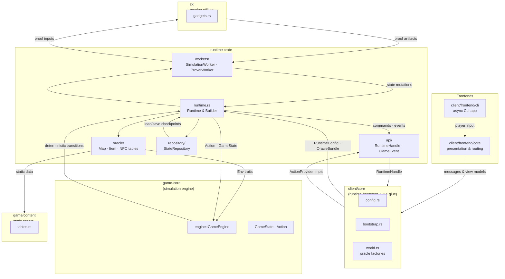
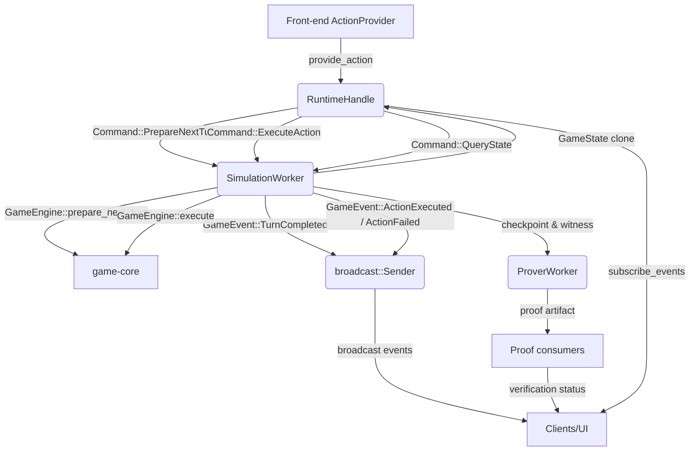

# Dungeon Project Architecture

> _Last updated: 2025-10-09_

## 1. System Overview

The Dungeon project is structured as a Rust workspace composed of multiple crates that collaborate to deliver a deterministic, provable dungeon crawler. The high-level flow is:

1. **Front-ends (CLI, UI, automation)** gather player and NPC input.
2. **`client-core`** translates front-end messages into runtime-facing actions and bootstraps oracle bundles.
3. **`runtime`** orchestrates the game loop, delegates gameplay execution to background workers, and emits game events.
4. **`game-core`** (currently stubbed in this repo snapshot) provides the deterministic simulation engine and domain models such as `GameState`, `Action`, and map/environment descriptions.
5. **`zk`** (work in progress) will contain proving-friendly utilities shared by the prover worker and any off-chain verification services.
6. **Persistence and blockchain integration (future)** will bridge runtime checkpoints to chain-facing artifacts.

The guiding principles are:

- **Layered boundaries**, so each crate only depends on the surfaces it requires.
- **Determinism first**, ensuring all runtime decisions are reproducible for ZK/STARK proving.
- **Pluggable providers**, letting clients swap input sources, oracle data, and persistence backends.
- **Observability**, exposing event streams and handles suitable for synchronous or async clients.

## 2. Workspace Layout

```
root
├── crates
│   ├── client
│   │   ├── core/              # Shared UI/CLI logic (message types, view models, config)
│   │   └── frontend/          # Concrete front-ends (CLI today, UI later)
│   ├── game                   # Domain content & core simulation (split into future crates)
│   ├── runtime                # Orchestrator, API façade, workers, oracle/repository adapters
│   └── zk                     # Proving-focused utilities and shared gadgets (planned)
├── docs                       # Architecture, research notes, design decisions
└── target                     # Build artifacts (ignored)
```

### 2.1 Workspace Dependency Graph



Arrows are annotated with the primary data exchanged between crates or modules, illustrating both build-time dependencies and runtime flow.

## 3. Runtime Architecture

The `runtime` crate is the central orchestrator. Its module structure mirrors the runtime layers:

- `api/`: Public surface consumed by other crates (`RuntimeHandle`, `GameEvent`, `ActionProvider`, error types).
- `runtime.rs`: Builder-based orchestrator that wires channels, workers, and providers.
- `workers/`: Background tasks such as the `SimulationWorker` (live) and `ProverWorker` placeholder.
- `oracle/`: Adapters exposing static game content (maps, NPC templates, loot tables) in a form compatible with `game-core`.
- `repository/`: Traits and in-memory implementations for persisting mutable state like saves and checkpoints.

### 3.1 Runtime Control Flow



1. Clients ask the `RuntimeHandle` to prepare the next turn, which routes a command to the `SimulationWorker`.
2. The worker invokes `game-core::GameEngine`, updates the authoritative `GameState`, and emits events.
3. After deciding the next action via the appropriate `ActionProvider`, the client issues `ExecuteAction`.
4. Successful execution updates the active set, emits action events, and hands a checkpoint plus witness data to the prover worker, which produces proof artifacts for downstream consumers and UIs.
5. Front-ends consume both gameplay events and proof status; failures continue to surface as `ActionFailed` events for immediate feedback.

### 3.2 Worker Responsibilities

- **Simulation Worker (implemented)**
  - Owns the canonical `GameState`.
  - Processes turn scheduling, action execution, and activation radius maintenance.
  - Publishes events through a `broadcast` channel for fan-out consumption.

- **Prover Worker (planned)**
  - Will take snapshots/checkpoints from the runtime and generate zero-knowledge proofs of correct execution.
  - Will integrate with the `zk` crate for hashing circuits, transcript generation, and proof serialization.
  - Expected to run in parallel with the simulation worker, consuming events or checkpoints over an async channel.

- **Submitter / Chain Worker (planned)**
  - Will handle packaging proofs and state commitments for blockchain submission.
  - Needs rate-limiting, retry logic, and secure signing infrastructure.

## 4. Action Providers

`ActionProvider` is an async trait allowing runtime users to plug in any intent source:

- **Human Input** (CLI/UI): collects player commands, double-checks entity/turn alignment, and forwards actions.
- **AI / NPC Scripts**: optional NPC providers can execute heuristics or ML policies.
- **Fixtures / Replay**: deterministic playback for regression testing or speed runs.

Future plans include:

- **Remote providers** over gRPC/WebSocket for multiplayer experiments.
- **On-chain agents** for blockchain-based decision making.

## 5. Oracle and Repository Layers

### 5.1 Oracle Bundle

`OracleManager` wraps immutable game content sourced from map, item, table, and NPC oracle implementations. These adapters:

- Serve `game-core` traits with deterministic, read-only data.
- Are typically constructed by `client-core` factories (`TestOracleFactory`, etc.).
- Can be swapped with real content once `game-content` is populated.

Planned enhancements:

- Streaming content updates for live events.
- Content versioning to align with provable game states.

### 5.2 Repositories

The repository layer persists mutable runtime data:

- `StateRepository`: trait describing load/save/checkpoint operations.
- `InMemoryStateRepo`: current implementation for tests and demos.

Upcoming work:

- Database-backed repositories (RocksDB, Postgres) for durable saves.
- Snapshot compression and Merkle commitments for proofs.
- Gossip integration to share state/off-chain updates across nodes.

## 6. Front-end Integration

The client crates consume the runtime API and provide UX glue:

- **`client-core`**: defines configuration, message passing, view models, and orchestrates the front-end runtime handle.
- **`client/frontend/cli`**: offers a terminal interface with asynchronous event loops, action providers, and UI presentation.
- **Future UI layers**: Bevy or WebAssembly front-ends can reuse `client-core` abstractions to subscribe to runtime events and render state.

## 7. Proving and Blockchain Integration Roadmap

| Component | Status | Description |
|-----------|--------|-------------|
| `ProverWorker` | placeholder | Will generate STARK proofs for each game tick or checkpoint. Depends on circuits in `zk` crate. |
| `zk` crate | scaffolded | Provides hashing, transcript utilities, and potentially recursion-friendly gadgets. |
| Proof transport | planned | Mechanism to serialize proofs to the front-end or submitter worker. |
| Blockchain bridge | planned | Smart contracts and RPC clients to publish proofs/state roots on-chain. |
| State commitments | planned | Merkle trees or polynomial commitments anchoring runtime state. |

Expected workflow:

1. Simulation worker produces deterministic state updates and checkpoints.
2. Prover worker consumes checkpoints, runs proving routines, and emits proof artifacts.
3. Submitter worker (or external service) packages the proof plus state commitments for blockchain submission.
4. On-chain verifier contract validates proofs and updates game state roots.

## 8. Design Philosophy

- **Deterministic Core, Decoupled I/O**: All randomness and side-effects are injected at the edges (providers, repositories), keeping `game-core` and `runtime` deterministic.
- **Trait-based Extensibility**: Oracles, providers, and repositories are trait objects so builds can swap implementations without modifying orchestration.
- **Async, Message-driven**: Workers communicate via `tokio` channels, enabling concurrent pipelines (simulation, proof generation, submission).
- **Incremental Proof Adoption**: Placeholders like `ProverWorker` keep the integration points visible, guiding future development.
- **Testing First**: In-memory repositories, wait-action providers, and event broadcasts enable fast unit/integration tests before heavy proving work lands.

## 9. Future Enhancements

- **Content pipeline**: Introduce tooling to author maps/NPCs and feed them into oracle modules.
- **Dynamic NPC activation**: Use pathfinding/visibility heuristics instead of axis-aligned radius checks.
- **Analytics & Telemetry**: Emit structured metrics/events for dashboards.
- **Multiplayer / Remote runtime handles**: Expose runtime commands over the network with authentication and replay protection.
- **Editor mode**: Build on the runtime handle to offer a map/entity editor for designers.

---

_This document aims to remain living documentation. When major architectural decisions shift (new crates, worker topology changes, proof pipeline implementation), please update this file alongside the code and record rationale in `docs/research.md`._
