# Dungeon Project Architecture

> **Status:** Living document
>
> **Scope:** Architectural overview of the Dungeon project’s crate structure, runtime flow, and future proving integration.

---

## 1. System Overview

The Dungeon project is structured as a Rust workspace composed of multiple crates that collaborate to deliver a deterministic, provable dungeon crawler. The high-level flow is:

1.  **Front-ends (CLI, UI, automation)** gather player and NPC input through the `FrontendApp` abstraction.
2.  **`client`** orchestrates the application, wiring together the runtime, frontend, and optional blockchain layers.
3.  **`runtime`** orchestrates the game loop via the `SimulationWorker`, delegates gameplay execution to background workers, and emits game events through a broadcast channel.
4.  **`game-core`** provides the pure deterministic simulation engine with a comprehensive action system (`GameEngine::execute`), domain models (`GameState`, `Action`), and validation schema.
5.  **`game-content`** supplies static content (maps, items, NPCs, loot tables) consumed by oracle implementations.
6.  **`zk`** provides the proving backends (RISC0, SP1) and circuits for generating zero-knowledge proofs of game state transitions.
7.  **`contracts`** (Move) manages on-chain game sessions, optimistic verification with challenge periods, and Walrus-based action log storage.

The guiding principles are:

-   **Layered boundaries**, so each crate only depends on the surfaces it requires.
-   **Determinism first**, ensuring all runtime decisions are reproducible for ZK/STARK proving.
-   **Pluggable providers**, letting clients swap input sources, oracle data, and persistence backends.
-   **Observability**, exposing event streams and handles suitable for synchronous or async clients.

## 2. Workspace Layout

```
root
├── contracts/                 # Smart contracts (Move)
│   └── move/                  # Sui Move packages (game_session, proof_verifier)
├── crates
│   ├── client/                # Application orchestrator (CLI, Blockchain, Bootstrap)
│   │   ├── src/               # Main entry point and orchestration logic
│   │   ├── frontend/          # UI implementations (CLI, Core abstraction)
│   │   └── blockchain/        # Blockchain client adapters (Sui)
│   ├── game
│   │   ├── core/              # Pure deterministic state machine (no I/O, crypto, or randomness)
│   │   └── content/           # Static content and fixtures (maps, items, NPCs, loot tables)
│   ├── runtime/               # Orchestrator, API façade, workers, oracle/repository adapters
│   ├── zk/                    # Proving backends (RISC0, SP1) and circuits
│   └── xtask/                 # Build and development automation tools
├── docs/                      # Architecture, research notes, design decisions
└── target/                    # Build artifacts (ignored)
```

### 2.1 Workspace Dependency Graph

```mermaid
flowchart TB
    %% --- Node Styling Definitions ---
    classDef frontend fill:#bbdefb,stroke:#1976d2,stroke-width:2px,color:#0d47a1;
    classDef client fill:#c5cae9,stroke:#303f9f,stroke-width:2px,color:#1a237e;
    classDef runtime fill:#b2dfdb,stroke:#00796b,stroke-width:2px,color:#004d40;
    classDef core fill:#ffccbc,stroke:#d84315,stroke-width:2px,color:#bf360c;
    classDef zk fill:#e1bee7,stroke:#7b1fa2,stroke-width:2px,color:#4a148c;
    classDef chain fill:#cfd8dc,stroke:#455a64,stroke-width:2px,color:#263238;
    classDef walrus fill:#ffe0b2,stroke:#f57c00,stroke-width:2px,color:#e65100;

    %% --- Subgraphs & Nodes ---
    subgraph Frontends ["🖥️ Presentation Layer"]
        direction TB
        cli_client["📟 Terminal UI<br/>(client/frontend/cli)"]:::frontend
        future_ui["🌐 Future Frontends<br/>(Bevy, WebAssembly)"]:::frontend
    end

    subgraph Client ["🔌 Client Layer"]
        direction TB
        orchestrator["🎬 Client Orchestrator"]:::client
        blockchain_client["🔗 Blockchain Client<br/>(Sui Adapter)"]:::client
    end

    subgraph Runtime ["⚙️ Runtime Layer"]
        direction TB
        api_mod["📡 api/<br/>RuntimeHandle · GameEvent"]:::runtime
        runtime_orch["🧠 Runtime Orchestrator"]:::runtime
        workers_mod["👷 workers/<br/>Simulation · Prover · Persistence"]:::runtime
        oracle_mod["🔮 oracle/<br/>MapOracle · ItemOracle"]:::runtime
        repo_mod["💾 repository/<br/>ActionBatch · StateRepo"]:::runtime
    end

    subgraph Game ["🦀 Game Logic (Shared)"]
        direction TB
        game_core["🧩 game-core<br/>(Engine, State, Actions)"]:::core
        game_content["📦 game-content<br/>(Static Assets)"]:::core
    end

    subgraph ZK ["🔐 Zero-Knowledge"]
        direction TB
        prover_backend["🛡️ Proving Backends<br/>(RISC0, SP1, Stub)"]:::zk
    end

    subgraph Infrastructure ["☁️ On-Chain & Storage"]
        direction TB
        move_contract["💧 Game Session<br/>(Sui Move)"]:::chain
        walrus["🦭 Walrus Storage<br/>(Action Logs)"]:::walrus
    end

    %% --- Connections ---
    cli_client -->|"implements"| orchestrator
    
    orchestrator -->|"initializes"| runtime_orch
    orchestrator -->|"uses"| blockchain_client
    
    blockchain_client -.->|"submits proofs"| move_contract
    blockchain_client -.->|"uploads logs"| walrus

    runtime_orch -->|"exposes"| api_mod
    runtime_orch -->|"manages"| workers_mod
    
    workers_mod -->|"executes"| game_core
    workers_mod -->|"generates proofs"| prover_backend
    workers_mod -->|"persists"| repo_mod
    workers_mod -->|"injects Oracle"| game_core
    
    oracle_mod -->|"wraps"| game_content
    oracle_mod -.->|"implements traits"| game_core
    
    prover_backend -->|"proves"| game_core

    %% --- Background Styling (Soft Pastel Colors) ---
    style Frontends fill:#f0f8ff,stroke:#90caf9,stroke-width:1px,stroke-dasharray: 5 5
    style Client fill:#f3f4fa,stroke:#9fa8da,stroke-width:1px,stroke-dasharray: 5 5
    style Runtime fill:#e8f5e9,stroke:#80cbc4,stroke-width:1px,stroke-dasharray: 5 5
    style Game fill:#fffbe6,stroke:#ffab91,stroke-width:1px,stroke-dasharray: 5 5
    style ZK fill:#f3e5f5,stroke:#ce93d8,stroke-width:1px,stroke-dasharray: 5 5
    style Infrastructure fill:#f5f5f5,stroke:#b0bec5,stroke-width:1px,stroke-dasharray: 5 5
```



## 3. Runtime Architecture

The `runtime` crate is the central orchestrator. Its module structure mirrors the runtime layers:

-   **`api/`**: Public surface consumed by other crates (`RuntimeHandle`, `GameEvent`).
-   **`workers/`**: Background tasks coordinating game execution.
    -   **`SimulationWorker`**: Owns canonical `GameState`, processes turns/actions, broadcasts events.
    -   **`ProverWorker`**: Monitors completed action batches and generates ZK proofs.
    -   **`PersistenceWorker`**: Manages state checkpoints, action log rotation, and event persistence.
    -   **`MetricsWorker`**: Collects and exposes telemetry.
-   **`repository/`**: Traits and implementations for persisting mutable state and action logs.

### 3.1 Worker Responsibilities

#### Simulation Worker ✅
-   Owns the canonical `GameState` and runs the game loop.
-   Processes commands: `PrepareNextTurn`, `ExecuteAction`, `QueryState`.
-   Broadcasts `GameEvent` notifications (TurnCompleted, ActionExecuted).
-   Manages entity activation and turn-based cooldowns.

#### Persistence Worker ✅
-   **Checkpoint System**: Manages "Action Batches".
    -   Creates a checkpoint every N actions (configurable).
    -   Rotates action log files upon checkpoint.
    -   Saves a state snapshot at the batch boundary.
-   **Event Logging**: Persists all game events to disk.
-   **Coordination**: Notifies `ProverWorker` when a batch is complete and ready for proving.

#### Prover Worker ✅
-   **Batch Proving**: Consumes completed action batches from `PersistenceWorker`.
-   **Proof Generation**: Uses the `zk` crate to generate cryptographic proofs (RISC0/SP1) that `Start State + Actions = End State`.
-   **Parallelism**: Supports parallel proof generation for multiple batches.
-   **Artifacts**: Saves proof files and updates batch status to `Proven`.

### 3.2 Runtime Control Flow

```mermaid
sequenceDiagram
    autonumber
    
    %% --- Participants ---
    box "Frontend & Client" #e3f2fd
        participant User as 👤 User
        participant CLI as 📟 CLI / Frontend
        participant Client as 🔌 Client Orch
    end
    
    box "Runtime Layer" #e8f5e9
        participant Handle as 📡 RuntimeHandle
        participant Sim as 👷 SimulationWorker
        participant Persist as 💾 PersistenceWorker
        participant Prover as 🛡️ ProverWorker
    end
    
    box "Game Logic" #fff3e0
        participant Engine as 🧩 GameEngine
        participant State as 🦀 GameState
    end
    
    box "Infrastructure" #f3e5f5
        participant Walrus as 🦭 Walrus Storage
        participant Chain as 💧 Sui Blockchain
    end

    %% --- Phase 1: Real-time Gameplay (Hot Path) ---
    note right of User: ⚡️ Phase 1: Real-time Gameplay
    
    User->>CLI: Input Action (e.g., Move)
    CLI->>Handle: ExecuteAction(action)
    Handle->>Sim: Command::ExecuteAction
    
    activate Sim
    Sim->>Engine: execute(action, current_state)
    activate Engine
    Engine->>State: validate & apply
    Engine-->>Sim: Ok(StateDelta, NewState)
    deactivate Engine
    
    Sim->>Sim: Update Canonical State
    
    par Broadcast Events
        Sim-->>Handle: Event::ActionExecuted
        Handle-->>CLI: Update UI
        CLI-->>User: Render New State
    and Persist Event
        Sim-->>Persist: Event::ActionExecuted
    end
    deactivate Sim

    %% --- Phase 2: Persistence & Batching (Async) ---
    note right of User: 💾 Phase 2: Async Persistence
    
    activate Persist
    Persist->>Persist: Append to Action Log
    
    alt Batch Limit Reached
        Persist->>Persist: Close Batch & Save State Snapshot
        Persist->>Prover: Notify: Batch Complete
    end
    deactivate Persist

    %% --- Phase 3: Proving & Submission (Background) ---
    note right of User: 🔐 Phase 3: ZK Proving & On-Chain
    
    activate Prover
    Prover->>Prover: Load Batch & State
    Prover->>Prover: Generate ZK Proof (RISC0/SP1)
    Prover-->>Handle: Event::ProofGenerated
    deactivate Prover
    
    Handle-->>Client: Event::ProofGenerated
    
    activate Client
    Client->>Walrus: Upload Action Log Blob
    Walrus-->>Client: Blob ID
    Client->>Chain: Submit Transaction(Proof, BlobID)
    Chain-->>Client: Tx Confirmation
    deactivate Client
```



1.  **Action Execution**: User input is translated into a command, validated by the `GameEngine`, and applied to the state.
2.  **Event Broadcast**: The result is immediately broadcast to the UI for real-time feedback and sent to the `PersistenceWorker`.
3.  **Persistence & Batching**: Actions are logged to disk. When a batch fills up (e.g., 10 actions), a checkpoint is created.
4.  **Proving**: The `ProverWorker` picks up the completed batch and generates a ZK proof in the background.
5.  **Submission**: The `Client` uploads the action log to Walrus and submits the proof + blob ID to the blockchain.

## 4. ZK & Proving Architecture

The `zk` crate provides a unified interface for multiple proving backends, selectable via feature flags.

### 4.1 Supported Backends
-   **RISC0** (`feature = "risc0"`): Production-grade zkVM. Generates STARKs/SNARKs.
-   **SP1** (`feature = "sp1"`): Succinct's SP1 zkVM. Supports Groth16/PLONK.
-   **Stub** (`feature = "stub"`): Development backend. Instant "proofs" for fast iteration.

### 4.2 Proof Workflow
1.  **Input**: Start State Root, End State Root, Action Log Hash.
2.  **Circuit**: Verifies that applying the action log to the start state results in the end state, following all game rules.
3.  **Output**: A cryptographic proof (Groth16/STARK) verifying the transition.

## 5. Blockchain Integration (Sui + Walrus)

The project uses a **Hybrid On-Chain/Off-Chain** architecture with **Optimistic Verification**.

### 5.1 Smart Contract (`game_session.move`)
-   **Session Object**: Tracks `oracle_root`, `state_root`, `nonce`, and `finalized` status.
-   **Optimistic Updates**:
    -   Players submit a ZK proof + Action Log Blob ID (Walrus).
    -   Contract verifies the ZK proof (currently disabled for hackathon due to verifier incompatibility, but logic is in place).
    -   Updates `state_root` and stores the Action Log reference.
-   **Challenge Period**:
    -   Action logs are stored as Dynamic Object Fields.
    -   A challenge period (e.g., 7 days) allows verifiers to inspect logs on Walrus and challenge invalid transitions.
    -   Expired logs can be cleaned up for storage rebates.

### 5.2 Walrus Integration
-   **Action Logs**: Full action sequences are too large for on-chain storage.
-   **Blob Storage**: Action logs are uploaded to Walrus (decentralized storage).
-   **Commitment**: The Walrus Blob ID is committed on-chain, binding the proof to the specific data.


## 6. Front-end Integration

The `client` crate provides a layered architecture:

-   **`client-frontend-core`**: Defines `FrontendApp` trait and shared view models.
-   **`client-frontend-cli`**: Terminal-based UI.
    -   **Examine Mode**: Cursor-based inspection of tiles/entities.
    -   **Real-time**: Renders updates from `GameEvent` stream.
-   **Future**: Bevy (2D/3D), WebAssembly.

## 7. Data Persistence Strategy

Filesystem-based repository structure (managed by `PersistenceWorker`):

```
{base_dir}/{session_id}/
├── actions/               # Action logs (rotated per batch)
│   ├── actions_{session}_{start}_{end}.log
│   └── ...
├── batches/               # Batch metadata (status, nonces)
│   ├── batch_{end_nonce}.json
│   └── ...
├── states/                # State snapshots (at batch boundaries)
│   ├── state_{nonce}.bin
│   └── ...
├── proofs/                # Generated ZK proofs
│   ├── proof_{start}_{end}.bin
│   └── ...
└── events/                # Full event stream
    └── events_{session}.log
```

---

_This document reflects the architecture as of the "Prover & Persistence" update. Future work includes enabling on-chain ZK verification._
